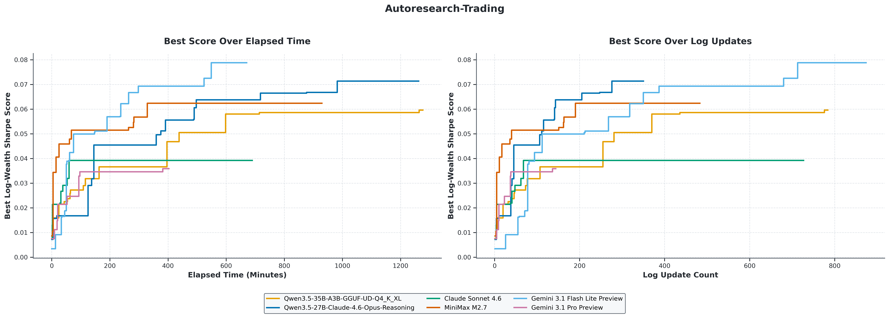
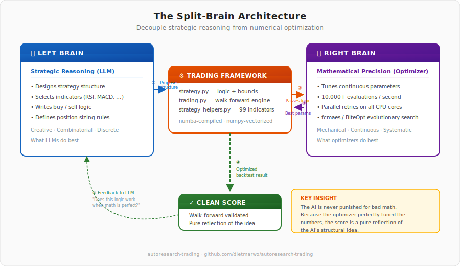
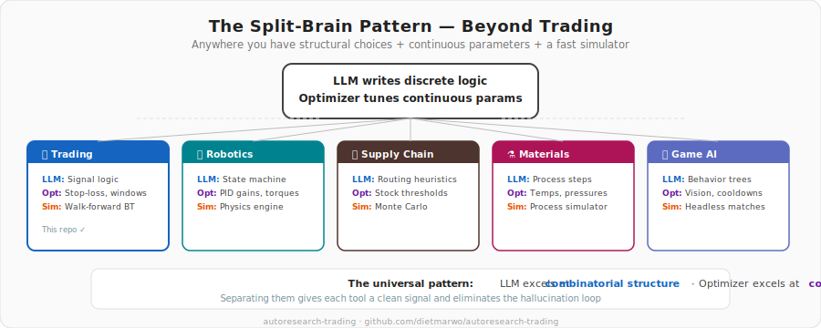
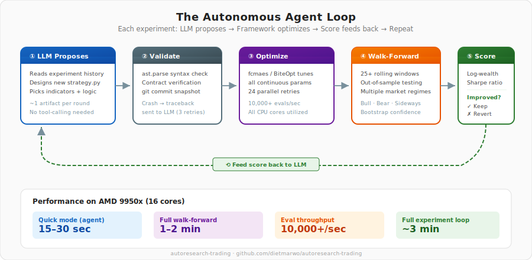
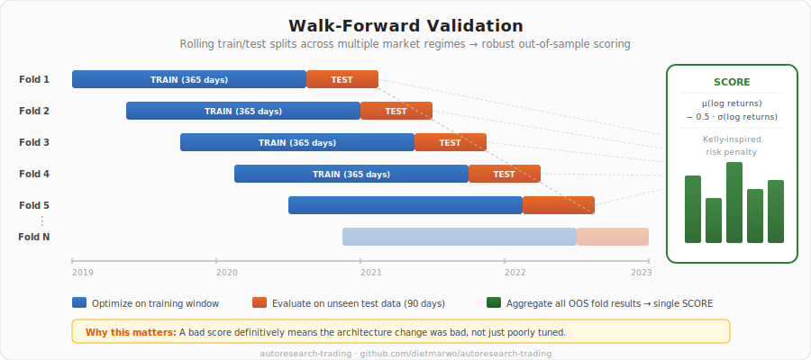

# autoresearch-trading



Autonomous AI-driven discovery of trading strategies, inspired by [Karpathy's autoresearch](https://github.com/karpathy/autoresearch).

## The Core Idea: Splitting the Brain

If you've ever tried to get a language model to design a trading strategy on its own, you've probably hit a wall. AI models are great at writing code and structuring logic, but they are terrible at guessing continuous numbers.

Imagine an AI writes a strategy that buys when the RSI drops below a certain number. It guesses a threshold of 30, runs the test, and loses money. Now the AI is confused. Was using the RSI a bad idea? Or was 30 just the wrong number? The AI has no way of knowing. Because of this, it often abandons good ideas just because the parameters were slightly off.



This project fixes that by splitting the job in half. Both tools get to do exactly what they are best at:

1. **The AI handles the creative logic.** The agent acts like a human researcher. It decides which indicators to use, writes the buy and sell rules, and structures the code. 
2. **A classic optimizer handles the math.** We hand the AI's code over to a traditional evolutionary optimizer ([fcmaes/BiteOpt](https://github.com/dietmarwo/fast-cma-es)). It tests thousands of parameter combinations in seconds to find the absolute best numbers for the AI's logic. 

Finally, we run strict walk-forward validation to see if the strategy survives in unseen markets. We give that final score back to the AI. 

Because the optimizer perfectly tuned the numbers first, the score is a pure reflection of the AI's *idea*. The AI isn't punished for bad math. It learns what logical structures actually work. The agent proposes a new strategy, the framework optimizes and scores it, the agent sees the result, and the loop repeats. Leave it running overnight and wake up to a log of experiments and (hopefully) a profitable strategy.

## Where else does this work?

This "split brain" approach—letting an AI write the discrete logic tree while a classic optimizer tunes the continuous numbers—isn't just for trading. It solves the exact same problem anywhere you have a fast simulator. 



Here are a few other places this architecture shines:

* **Robotics and Control Systems:** The AI writes the state machine for a robot arm (e.g., approach, grab, lift). The optimizer then runs a physics simulation to tune the exact PID gains, motor torques, and acceleration curves.
* **Supply Chain and Logistics:** The AI writes the heuristic routing rules for a warehouse. The optimizer runs Monte Carlo simulations to find the perfect safety stock thresholds and delay penalties.
* **Chemical Engineering and Materials:** The AI proposes a sequence of manufacturing steps or a new polymer blend based on research papers. The optimizer runs a simulator to dial in the exact baking temperatures, atmospheric pressures, and molar ratios.
* **Video Game AI:** The AI drafts the behavior tree for an enemy NPC ("if the player reloads, flank left"). The optimizer plays thousands of headless matches to tune their vision radius, cooldown timers, and movement speed so they win exactly 50% of the time to keep the game fun.
* **Audio and Signal Processing:** The AI chains together audio components (like routing a multi-band compressor into an EQ and a limiter). The optimizer tunes the attack times, release times, and frequency thresholds to hit a target signal-to-noise ratio.

Anytime you have a mix of structural choices (code) and continuous numbers (parameters), this architecture is the way to go.

## Why this works better than end-to-end AI optimisation

In Karpathy's original autoresearch, the AI agent modifies a neural network training script and observes whether validation loss improved after a 5-minute training run. The AI handles *everything* — architecture, hyperparameters, optimizer settings — and gets a single noisy sample of whether the change helped.

This project splits the problem at the right seam:
         
This gives the AI a much cleaner signal than end-to-end autoresearch. 
A bad score here definitively means the architecture change was bad, not just poorly tuned.

The core idea: **separate strategy structure from parameter tuning**.  An AI agent
designs the trading logic — which indicators to use, when to buy and sell, how to
size positions.  A conventional optimiser
([fcmaes/BiteOpt](https://github.com/dietmarwo/fast-cma-es)) then finds the best
parameters for that structure.  Walk-forward validation on rolling out-of-sample
windows measures whether the result generalises — producing a single scalar score
that tells the agent whether its design change helped.



The agent proposes a new strategy, the framework optimises and scores it, the agent
sees the result, and the loop repeats indefinitely.  Leave it running overnight and
wake up to a log of experiments and (hopefully) a profitable strategy.



The AI focuses on the creative part where LLMs excel — structural decisions,
combining ideas from the literature, pattern recognition across experiments.  The
optimiser handles the mechanical part where evolutionary algorithms excel —
searching a continuous parameter space with tens of thousands of fast evaluations.

## The optimiser: fcmaes

[fcmaes](https://github.com/dietmarwo/fast-cma-es) is a Python gradient-free
optimisation library built for exactly this use case.  It provides the inner
optimisation loop that finds the best parameters for each strategy structure on
each walk-forward fold.

Key advantages of fcmaes for trading strategy optimisation:

**Parallel retry on all CPU cores.**  The `retry.minimize` function launches
independent optimisation runs on every available core.  On a 16-core AMD 9950x,
that means 24 parallel attempts, each exploring the parameter
space from a different random starting point.  The best result across all retries
is kept.  This is crucial because trading strategy fitness landscapes are highly
multimodal — there are many local optima, and a single optimisation run will often
get trapped in one.

**Low overhead.**  The core optimisers (BiteOpt, CMA-ES, Differential Evolution)
are implemented in C++ and called through thin Python bindings.  The overhead per
function evaluation is microseconds, not milliseconds.  Combined with
numba-compiled trading simulations, this means the framework achieves 10,000+
strategy evaluations per second.  A complete optimisation over 4 tickers finishes
in about one second.

**BiteOpt — a self-adapting evolutionary algorithm.**  The default optimiser,
[BiteOpt](https://github.com/avaneev/biteopt) by Aleksey Vaneev, is a
population-based algorithm that adapts its own search strategy during the run.  It
combines ideas from differential evolution, genetic algorithms, and pattern search,
automatically tuning the balance between exploration and exploitation.  For trading
strategy optimisation, this matters because the fitness landscape changes shape
between walk-forward folds — parameters that work in a bull market occupy a
different region than those that work in a sideways market.  BiteOpt's
self-adaptation handles this naturally.

**Multi-objective support.**  While this project uses single-objective walk-forward
scoring, fcmaes also provides `modecpp` — a C++-based multi-objective
differential evolution optimiser with NSGA-II population updates.  This enables
Pareto-front analysis where each ticker gets its own objective, revealing which
parameter regions favour which assets.

## Architecture

```
agent.py                          ← agentic loop (LLM ↔ framework)
  │
  │  proposes strategy.py
  │  runs trading.py
  │  parses SCORE
  │  keeps or reverts (git)
  │
  ├── strategy.py                 ← THE FILE THE AI EDITS
  │     └── get_strategy()
  │           ├── name, variables, bounds
  │           └── simulate(close, high, low, volume, x)
  │                 ├── indicator computation (numpy)
  │                 └── @njit trading loop
  │
  ├── trading.py                  ← walk-forward framework (read-only)
  │     ├── load_strategy()       — imports and validates strategy.py
  │     ├── walk_forward()        — rolling train/test splits
  │     ├── WindowFitness         — calls simulate(), feeds to optimiser
  │     ├── optimize_window()     — fcmaes retry.minimize + BiteOpt
  │     ├── compute_score()       — log-wealth Sharpe from fold factors
  │     ├── bootstrap_evaluate()  — stationary bootstrap confidence bands
  │     └── walk_forward_bootstrap() — combined validation
  │
  ├── strategy_helpers.py         ← 99 @njit indicator functions (read-only)
  │     ├── Trading primitives    — buy_all, sell_all, buy/sell_fraction
  │     ├── Moving averages       — SMA, EMA, WMA, DEMA, TEMA, HMA, KAMA, ...
  │     ├── Momentum              — RSI, MACD, Stochastic, CCI, MFI, TSI, ...
  │     ├── Trend                 — ADX, Aroon, Supertrend, Parabolic SAR, ...
  │     ├── Volatility            — Bollinger, ATR, Keltner, NATR, ...
  │     ├── Volume                — OBV, CMF, Force Index, VWAP, ...
  │     ├── Channels              — Donchian, Ichimoku, pivot points
  │     ├── Utility               — crossover, z-score, drawdown, slope, ...
  │     └── warmup()              — pre-compiles all functions before fork()
  │
  └── program_trade.md            ← instructions for the AI agent (read-only)
```

## File descriptions

### `strategy.py` — the file the AI edits

This is the equivalent of Karpathy's `train.py`.  It defines a single function
`get_strategy()` that returns a dict with four keys:

- **`name`** — human-readable strategy name for logging.
- **`variables`** — list of parameter names (e.g., `["ema_period", "rsi_period", "wait_buy"]`).
- **`bounds`** — `([lower_bounds], [upper_bounds])` for the optimiser.
- **`simulate`** — a callable with signature `simulate(close, high, low, volume, x) → (growth_factor, num_trades)`.

The `simulate` function has two layers.  The outer layer computes indicators
(calling helpers like `ema_np`, `rsi_np`, `bollinger_np`) to produce numpy
arrays.  The inner layer is an `@njit`-compiled trading loop that iterates
through daily bars, using the precomputed arrays and scalar parameters from `x`
to decide buy/sell actions.

This two-layer design is critical for performance: indicator computation runs
once per call (numpy-vectorised), and the trading loop runs at C speed (numba
JIT-compiled).  Since the optimiser calls `simulate()` thousands of times per
walk-forward fold, the combined throughput must be thousands of evaluations per
second.

The baseline strategy is a simple EMA/SMA crossover with 4 parameters: EMA
period, SMA period, buy cooldown, sell cooldown.  The AI agent evolves this into
more sophisticated strategies by adding indicators, changing the logic, adjusting
position sizing, and tuning the parameter count.

### `strategy_helpers.py` — the indicator library

99 numba-compiled (`@njit`) functions organised in 8 categories:

| Category | Count | Examples |
|---|---|---|
| Trading primitives | 8 | `buy_all`, `sell_all`, `buy_fraction`, `sell_fraction`, `trailing_stop_hit`, `portfolio_value`, `position_size_kelly`, `hodl` |
| Moving averages | 10 | `ema_np`, `sma_np`, `wma_np`, `dema_np`, `tema_np`, `hma_np`, `kama_np`, `vwma_np`, `zlema_np`, `frama_np` |
| Momentum / oscillators | 13 | `rsi_np`, `macd_np`, `stochastic_np`, `williams_r_np`, `cci_np`, `roc_np`, `mfi_np`, `tsi_np`, `stoch_rsi_np`, `cmo_np` |
| Trend strength | 14 | `adx_np`, `aroon_np`, `supertrend_np`, `psar_np`, `trix_np`, `vortex_np`, `mass_index_np`, `linreg_slope_np`, `linreg_r2_np` |
| Volatility | 11 | `bollinger_np`, `bollinger_bandwidth_np`, `atr_np`, `natr_np`, `keltner_np`, `historical_vol_np`, `realized_volatility_np`, `choppiness_index_np`, `ulcer_index_np` |
| Volume | 9 | `obv_np`, `cmf_np`, `force_index_np`, `ad_line_np`, `vwap_np`, `rolling_vwap_np`, `vwap_deviation_np`, `volume_oscillator_np`, `volume_ratio_np` |
| Price channels | 3 | `donchian_np`, `pivot_points_np`, `ichimoku_np` |
| Statistical / utility | 31 | `crossover_np`, `zscore_np`, `drawdown_np`, `normalize_np`, `bars_since_np`, `trend_strength_np`, `mean_reversion_score_np`, `distance_from_high_np`, `distance_from_low_np` |

All functions operate on numpy float64 arrays and can be called both from regular
Python (indicator preparation) and from inside `@njit` trading loops.

The `warmup()` function at the bottom calls every function once with dummy data,
forcing numba to JIT-compile them in the parent process before any
`multiprocessing.fork()`.  This prevents heap corruption ("corrupted size vs.
prev_size") that occurs when child processes race to compile the same functions.

### `trading.py` — the walk-forward framework

The framework that connects strategy, optimiser, and validation.  It handles:

**Data loading and caching.**  Downloads OHLCV data from Yahoo Finance via
`yfinance` and caches it as compressed CSV files in `ticker_cache/`.  Subsequent
runs load from cache instantly.  Supports any ticker symbol available on Yahoo
Finance — crypto, stocks, ETFs, indices.

**Walk-forward validation.**  Slides a rolling window through the data:

```
|----train (365 days)----|--test (90 days)--|
         |----train----|--test--|
                  |----train----|--test--|
                           ...
```

Each fold optimises on the training window and evaluates on the unseen test
window.  The aggregate of all out-of-sample test results becomes the SCORE.  This
is much more robust than a single train/test split because it tests across
multiple market regimes — bull, bear, sideways, high-volatility, low-volatility.

**Scoring: log-wealth Sharpe.**  The single objective that drives the agent loop:

```
fold_log_returns = [log(geo_mean_factor) for each fold]
SCORE = mean(fold_log_returns) - 0.5 * std(fold_log_returns)
```

- A score of 0 means the strategy broke even (capital preservation).
- Positive scores mean profitable growth with good risk-adjustment.
- The λ=0.5 penalty (inspired by the Kelly criterion) ensures that a strategy
  which is profitable on 60% of folds but catastrophically loses on 40% scores
  worse than a strategy that profits modestly on 90% of folds.

**Stationary bootstrap** (Politis & Romano 1994).  Generates synthetic price
paths by resampling log-returns in variable-length blocks, preserving serial
dependence.  Used to measure confidence intervals on the optimised parameters and
detect overfitting — if a strategy looks great on real data but has a wide
bootstrap confidence interval, the parameters are fragile.

**Numba warmup.**  `load_strategy()` calls `warmup()` on both the helper library
and the strategy's own `simulate()` function before any multiprocessing begins.
This eliminates the fork+JIT corruption issue entirely.

### `agent.py` — the agentic loop

Connects to a local LLM (via OpenAI-compatible API) and runs the experiment loop
autonomously.  The design philosophy: **the runner handles all mechanics, the LLM
focuses on strategy design**.

The loop per experiment:

1. **Build context** — current best score, last N experiment results, current
   strategy.py.
2. **Call LLM** — ask for the next strategy.  The LLM responds with reasoning
   and a complete strategy.py in a code block.
3. **Validate** — syntax check (ast.parse), contract check (get_strategy,
   simulate, bounds present).
4. **Commit** — `git add strategy.py && git commit`.
5. **Run** — `python trading.py --mode walkforward > run.log 2>&1`.
6. **Parse** — extract SCORE, growth, volatility from the output.
7. **Keep or revert** — if score improved, keep the commit.  Otherwise
   `git reset --soft HEAD~1` (only undoes the commit, never overwrites other
   files like trading.py).
8. **Log** — append to results.tsv.
9. **Feed back** — record the result in the conversation for the next iteration.

**Crash recovery**: if the run crashes, the runner sends the traceback to the LLM
and asks it to fix the bug.  Up to 3 attempts per idea.  This handles the most
common failure mode — numba type errors from calling non-njit functions inside
@njit blocks.

**Context management**: each turn, the LLM receives a curated user message with
best overall experiments, best-per-family representatives, strong discarded
near-misses, representative failure modes, and recent experiments.  Most turns
also include the current best strategy code plus 2 alternative reference
strategies from different families.  Every exploration turn (default: every 6
completed experiments) hides the current best code and instead shows up to 3
alternative reference strategies so the model is pushed to branch out instead of
hill-climbing forever.  Only 2 lightweight conversation exchanges are kept
(brief summaries, no code duplication).  This keeps the prompt diverse enough
to avoid getting stuck in one strategy family while still fitting comfortably in
a 50K context window.

**No tool use**: unlike agentic frameworks that have the LLM drive individual bash
commands, this design has the LLM produce exactly one artifact per round trip — a
complete strategy.py file.  This is much more token-efficient and robust with
smaller local models that may struggle with multi-step tool-calling.

### `program_trade.md` — instructions for the AI agent

The agent's "skill file" — a compressed version of all the information the AI
needs to design effective strategies.  It includes:

- The strategy interface contract.
- A compact catalog of all 99 available indicator functions.
- Numba constraints and common mistakes.
- Strategy design heuristics (what works, what fails, how to interpret score
  components).
- The exact experiment loop specification.

The system prompt in `agent.py` is a further compression of this document,
optimised for the context window of a local model (50K tokens minimum).

## Performance characteristics

On a 16-core AMD 9950x:

| Operation | Time | Notes |
|---|---|---|
| Single-window optimisation (4 tickers) | ~1 second | 24 parallel BiteOpt retries × 500 evals each |
| Walk-forward (25 folds, default settings) | 1–2 minutes | 25 × optimisation + evaluation |
| Walk-forward (quick mode, agent.py) | 15–30 seconds | 8 retries × 250 evals |
| Strategy evaluation throughput | 10,000+ / second | numba + numpy, all cores |
| Agent loop (default) | ~3 min/experiment | LLM inference + walk-forward |
| Agent loop (full validation) | ~10 min/experiment | 48 retries, 2000 evals via --num-retries/--max-evals |

## Quick start

### Prerequisites

```bash
pip install -e .
```

This installs the runtime dependencies declared in `pyproject.toml`.

### 1. Run the baseline

```bash
python trading.py --mode walkforward --strategy strategy
```

This downloads ticker data (cached), runs walk-forward validation on the default
EMA/SMA crossover strategy, and prints the SCORE.

### 2. Start the autonomous agent

The agent works with local LLMs served via an OpenAI-compatible API and can
also call native Claude or Gemini APIs directly.  We recommend
[llama.cpp](https://github.com/ggml-org/llama.cpp)'s `llama-server` with a
Qwen3.5-35B MoE model for local runs — it produces good strategy code while
being small enough to run on a single GPU.

If raw strategy quality matters more than local inference cost or privacy,
hosted frontier models are currently the better default for this project.
OpenAI's GPT-5.4 mini and Anthropic's Claude Sonnet 4.6 are both explicitly
positioned for stronger coding and agentic work than their predecessors.

| Goal | Recommended model | Why |
|---|---|---|
| Cheapest local baseline | `unsloth/Qwen3.5-35B-A3B-GGUF:UD-Q4_K_XL` | Runs on a 16GB-class local GPU and is good enough to get the loop working end-to-end |
| Best local quality | `Reasoning/Qwen3.5-27B-Claude-4.6-Opus-Reasoning-Distilled-GGUF:Q8_0` | Better strategy design and reasoning than the faster local Qwen MoE, but much slower per experiment |
| Hosted Anthropic | `claude-sonnet-4-6` | Good price / quality / performance mix |
| Hosted Anthropic | `claude-opus-4-6` | Strong agent planning, coding, and long-context performance, but slow and expensive |
| Hosted Gemini | `gemini-pro-3.1` | Good price / quality / performance mix  |
| Hosted Gemini | `gemini-flash-3.1` | fast and cheap |
| Hosted best value | `gpt-5.4-mini` | Strong coding and agentic quality with much lower latency and cost than flagship hosted models |
| Hosted quality-first | `gpt-5.4` | Best OpenAI choice here when you want stronger agentic coding and are willing to pay for it |


**Minimum hardware: NVIDIA RTX 5060 Ti 16GB** (or equivalent 16GB VRAM GPU):

```bash
llama-server \
  -hf unsloth/Qwen3.5-35B-A3B-GGUF:UD-Q4_K_XL \
  --host 127.0.0.1 --port 8011 \
  --ctx-size 16384 \
  --temp 0.7 --top-p 0.95 --top-k 20 --min-p 0.0
```

The Q4 quantisation fits in 16GB VRAM with 16K context.  This is the minimum
recommended setup — smaller models (7B) produce too many crashes, and shorter
contexts lose experiment history.

**Recommended: dual NVIDIA RTX 3090 (2 × 24GB)** or similar multi-GPU setup:

```bash
llama-server \
  -hf unsloth/Qwen3.5-35B-A3B-GGUF:UD-Q6_K_XL \
  --host 127.0.0.1 --port 8011 \
  --ctx-size 50000 \
  --temp 0.7 --top-p 0.95 --top-k 20 --min-p 0.0
```

The Q6 quantisation is higher quality (fewer quantisation artifacts in generated
code) and 50K context gives the agent deeper experiment history for better
decision-making.

**Thinking alternative**

```bash
llama-server \
  -hf Reasoning/Qwen3.5-27B-Claude-4.6-Opus-Reasoning-Distilled-GGUF:Q8_0 \
  --host 127.0.0.1 --port 8011 \
  --ctx-size 50000 \
  --temp 0.7 --top-p 0.95 --top-k 20 --min-p 0.0
```

Slower but adds structured reasoning logic. 
This model excels in breaking down complex user problems, planning step-by-step methodologies.

**High-end: Apple Silicon with large unified memory** (M4 Max/Ultra 128GB+,
M3 Ultra, etc.):

```bash
# Qwen3.5-122B — significantly more capable strategy design
llama-server \
  -hf unsloth/Qwen3.5-122B-A22B-GGUF:UD-Q4_K_XL \
  --host 127.0.0.1 --port 8011 \
  --ctx-size 100000 \
  --temp 0.7 --top-p 0.95 --top-k 20 --min-p 0.0
```

The 122B model produces more creative strategies, makes fewer numba mistakes,
and reasons better about indicator semantics.  On Apple Silicon the large
unified memory pool can host both model weights and context without GPU VRAM
constraints.

Any OpenAI-compatible API works — the agent connects via the standard
`/v1/chat/completions` endpoint.  You can also use a remote server:

```bash
python agent.py --base-url http://192.168.1.100:8011/v1
```

If your endpoint serves more than one model, pass `--model ...` explicitly.
The agent only auto-picks the first model from the provider when `--model` is
omitted, which is fine for a single-model `llama-server` but risky for hosted
APIs.

**Hosted API alternatives**

If you want higher-quality strategy proposals than a local 27B-35B model can
usually deliver, or you have no capable graphic card, 
the easiest upgrade path is a hosted frontier API.

**MiniMax2.7 via Anthropic native API**

```bash
pip install anthropic
export MINIMAX_API_KEY=MINIMAX_API_KEY

# Native Anthropic SDK path
python agent.py --model MiniMax-M2.7 --tag mar18
```

MiniMax-M2.7 is a cheap but very capable new model. Excellent 
in coding, computer use and agent planning. Start with this if
you have no capable graphic card. 

**Anthropic native API**

```bash
pip install anthropic
export ANTHROPIC_API_KEY=your_anthropic_key

# Native Anthropic SDK path
python agent.py --model claude-sonnet-4-6 --tag mar18
```

Claude Sonnet 4.6 is Anthropic's most capable Sonnet model so far, with
explicit improvements in coding, computer use, long-context reasoning, and
agent planning.

**Gemini native API**

```bash
pip install google-genai
export GEMINI_API_KEY=your_gemini_key

python agent.py --model gemini-3.1-flash-preview --tag mar18
or
python agent.py --model gemini-3.1-pro-preview --tag mar18
```
gemini-3.1-flash-preview is recommended here, for this application the price/performance ratio is superior.

**Anthropic via OpenAI SDK compatibility**

```bash
export ANTHROPIC_API_KEY=your_anthropic_key

# Compatibility path still works if you prefer a single OpenAI-style client
python agent.py --base-url https://api.anthropic.com/v1/ --model claude-sonnet-4-6 --tag mar18
```

When the base URL points at Anthropic, the agent will automatically use
`ANTHROPIC_API_KEY` for the compatibility path.  Native Claude and Gemini
imports are optional and are only needed when you use those model families.

Then run the agent:

```bash
# Quick iteration (~1 min per experiment)
python agent.py --tag mar18 --quick

# Default (~3 min per experiment, overnight mode)
python agent.py --tag mar18

# Crypto (more volatile market)
python agent.py --tag mar18-crypto --tickers BTC-USD ETH-USD XRP-USD ADA-USD --quick

# Push exploration turns more often
python agent.py --tag mar18 --explore-every 4 --quick

# Restart from a saved strategy file instead of base_strategy.py
python agent.py --tag mar18-restart --seed-file ./saved_strategy.py --quick

# Restart from strategy.py stored at a previous git revision
python agent.py --tag mar18-restart --seed-commit abc1234 --quick
```

**OpenAI API**

```bash
export OPENAI_API_KEY=your_openai_key

# Best value hosted option for coding / subagent work
python agent.py --base-url https://api.openai.com/v1 --model gpt-5.4-mini --tag mar18

# Quality-first hosted option
python agent.py --base-url https://api.openai.com/v1 --model gpt-5.4-mini --tag mar18
or
python agent.py --base-url https://api.openai.com/v1 --model gpt-5.4 --tag mar18
```
OpenAI announced GPT-5.4 mini as a major upgrade over GPT-5 mini for coding,
tool use, and subagent workflows while remaining much faster than the full
flagship model.  If your account exposes a snapshot or provider-specific alias
instead of the short name above, pass that exact model id via `--model`.

### 3. Monitor progress

```bash
# Watch the agent's output
tail -f results.tsv

# Check current best
grep "keep" results.tsv | sort -t$'\t' -k2 -n | tail -1

# See the git log of kept experiments
git log --oneline autoresearch/mar18
```

### 4. Restart from a seed

By default, the agent starts from `base_strategy.py`.  To branch the search
from a different starting point, pass exactly one of these flags:

- `--seed-file PATH` — load a local strategy file and use it as the starting `strategy.py`.
- `--seed-commit REV` — load `strategy.py` from a git revision such as a kept experiment commit.

Startup order is deterministic: the agent checks out the chosen branch first,
then writes the selected seed to `strategy.py`, preflights it, and runs the
first experiment on that seed unchanged.  Only after that first scored run does
the LLM start proposing modifications.

Examples:

```bash
# Branch from a hand-picked strategy file
python agent.py --tag mar20-alt1 --seed-file ./candidates/donchian_breakout.py --quick

# Branch from a previous kept commit
python agent.py --tag mar20-alt2 --seed-commit 30c7406 --quick
```

This is useful when a long run gets stuck in one family and you want to launch
several shorter trajectories from different promising ideas without editing
`base_strategy.py` by hand.

### 5. Exploration turns

The agent now alternates between two prompt styles:

- **Exploitation turns** — show the current best code and ask for a stronger refinement.
- **Exploration turns** — hide the current best code, show more alternative references, and explicitly ask for a structurally different valid idea.

By default, an exploration turn happens every 6 completed experiments.  You can
change that with:

```bash
# Explore more aggressively
python agent.py --tag mar20 --explore-every 4 --quick

# Disable scheduled exploration turns
python agent.py --tag mar20 --explore-every 0
```

This is the easiest way to reduce "stuck in one family" behavior without
loosening the syntax / contract validator.

## Customisation

### Different assets

The default tickers are US large-cap growth stocks: `AAPL AMD GOOGL NVDA`.  Any
Yahoo Finance ticker works.  Examples:

```bash
# Crypto (more volatile, higher potential but harder to beat breakeven in bull runs)
--tickers BTC-USD ETH-USD XRP-USD ADA-USD

# Sector ETFs
--tickers XLK XLF XLE XLV XLI

# International indices
--tickers ^GSPC ^FTSE ^N225 ^GDAXI

# Crypto + stocks mix
--tickers AAPL BTC-USD MSFT ETH-USD
```

### Different validation settings

```bash
# Longer training window (2 years instead of 1)
--train-days 504

# Shorter test window
--test-days 63

# More overlap between folds
--step-days 63
```

### Different LLM

See the hardware recommendations in "Start the autonomous agent" above.  The
minimum requirement is a 16GB VRAM GPU running Qwen3.5-35B-A3B at Q4
quantisation with 50K context.  Any OpenAI-compatible API endpoint works.

### Agent context tuning

The agent builds a curated prompt from several buckets: best overall
experiments, best-per-family representatives, strong discarded near-misses,
representative failure modes, and recent experiments.  `--top-k` controls the
main curated best/diverse budget, while `--recent-k` controls the explicit
recent-history tail.

```bash
# Default: curated best/diverse summary + 10 recent experiments
python agent.py

# Leaner context for smaller models
python agent.py --top-k 5 --recent-k 5

# Richer prompt for 100K+ context or stronger hosted models
python agent.py --top-k 20 --recent-k 15
```

Conversation exchanges are kept lightweight (2 brief exchanges, no code
duplication).  The full context — strategy code, curated experiment history, and
reference discarded code — is regenerated fresh each turn in the user message.

## Design rationale

### Why separate structure from parameters?

A trading strategy has two kinds of decisions:

1. **Structural**: which indicators to look at, what the buy/sell rules are, how
   to size positions.  These are discrete, combinatorial choices — there are
   infinitely many ways to combine indicators.

2. **Parametric**: what window sizes to use, what thresholds, what cooldown
   periods.  These are continuous variables in a bounded space.

LLMs are good at (1) — they can reason about indicator semantics, draw on
knowledge of trading literature, and generate working code.  They are bad at (2)
— searching a continuous space with 4–15 dimensions requires systematic
exploration, not language generation.

Evolutionary optimisers are the opposite: terrible at structural decisions but
excellent at continuous parameter search.  The split lets each tool do what it
does best.

### Why walk-forward instead of a single train/test split?

Markets are non-stationary.  A strategy optimised on 2019–2021 data might look
amazing because it learned to buy-and-hold during a bull run.  Testing on 2022
would reveal it fails completely in a downturn.  A single split can get lucky.

Walk-forward slides through 25+ time windows, each with its own
optimise-then-test cycle.  The aggregate score reflects performance across bull
markets, bear markets, sideways markets, and transitions between them.  This is
the standard in the backtest-overfitting literature (Bailey et al., "The
Probability of Backtest Overfitting").

### Why the log-wealth Sharpe score?

The geometric mean of fold factors captures average performance but ignores
consistency.  A strategy returning 2× on two folds and 0.25× on two others has
the same geometric mean as one returning 0.71× on all four — but the first is
much more dangerous.

The log-wealth Sharpe penalises inconsistency:

```
SCORE = mean(log(factors)) - 0.5 * std(log(factors))
```

This is inspired by the Kelly criterion, where optimal growth rate under
uncertainty is approximately `mean - ½·variance` of log-returns.  Using std
(rather than variance) gives slightly stronger risk penalisation, which is
appropriate for out-of-sample evaluation where overfit strategies tend to have
fat-tailed losses.

### Why numba for the trading simulation?

The optimiser evaluates each strategy ~12,000 times per fold (24 retries × 500
evaluations, each calling simulate once per ticker).  With 25 folds and 4 tickers,
that is 1.2 million simulation calls per walk-forward run.  Each simulation
iterates through 365 daily bars.  Pure Python would take minutes per fold; with
numba, it takes milliseconds.

The constraint is that all code inside `@njit` functions must use numpy arrays and
scalars — no pandas, no Python objects, no strings.  The `strategy_helpers.py`
library provides 99 pre-compiled indicator functions that the AI agent can compose
into strategies without worrying about numba compatibility.

### Why pre-compute indicators outside the trading loop?

Consider RSI with a 14-day period.  Computing it requires iterating through all
bars with Wilder's smoothing.  If RSI were computed inside the `@njit` trading
loop, it would be recalculated on every optimiser evaluation — wasteful since the
close prices don't change, only the parameters do.

The two-layer simulate design computes indicators in the outer function (called
once per evaluation) and passes them as arrays to the inner `@njit` loop.
Parameters that affect indicator computation (like periods) are handled correctly
because the outer function receives them from `x` and calls the appropriate helper
with the right period.

Parameters that affect only the trading logic (like cooldowns or thresholds) go
directly into the `@njit` loop as scalars.  This separation maximises the amount
of work done at numpy/numba speed.

## Recent Updates:

- Made `program_trade.md` the single source of truth for the agent system prompt. `agent.py` now loads only the marked compact prompt block at runtime and fails fast if the markers are missing or invalid, instead of silently falling back to a stale in-code copy.
- Synced `program_trade.md` with the actual autonomous runner behavior in `agent.py`, including git auto-init / branch setup, seed selection, quick/medium modes, preflight checks, crash retries, flat/no-trade rejection, and the real keep/revert loop.
- Added adaptive search steering to `agent.py`: the agent now tracks recent family dominance, experiments since last KEEP, flat/no-trade streaks, crash streaks, and the common “positive growth but still negative SCORE” failure mode.
- Added forced exploration when the search plateaus inside one dominant strategy family, so the agent can break out of local minima instead of waiting only for the fixed `--explore-every` cadence.
- Added model-specific prompt steering for Gemini and MiniMax. Gemini is now pushed away from endless micro-refinements of one family, while MiniMax is pushed away from over-constrained filter stacking and flat “safer” variants.
- Improved prompt feedback around volatility and benchmark-relative failure: when recent runs have decent raw growth but still poor SCORE, the prompt now explicitly tells the model that volatility and/or HODL-relative lag is the bottleneck.
- Documented updated search-tuning guidance from recent crypto runs: Qwen works best with moderate temperature and somewhat larger prompt memory, while Gemini Flash and MiniMax 2.7 benefit from slightly hotter sampling but smaller `--top-k` / `--recent-k` to reduce family lock-in.
- Added explicit seed restarts to agent.py with `--seed-file` and `--seed-commit`, so new runs can start from a chosen strategy instead of always from `base_strategy.py`.
- Added scheduled exploration turns to agent.py with `--explore-every`, where the prompt hides the current best code and asks for a materially different valid idea instead of pure hill-climbing.
- Expanded prompt references from a single discarded example to 2-3 alternative strategy files per turn, with more reference slots on exploration turns to improve structural diversity.
- Improved strategy-family labeling in agent.py so prompt curation can distinguish families like breakout, mean-reversion, pullback, trend, MACD, Supertrend, Bollinger, Donchian, and different exit styles more reliably.
- Updated README.md with the new seed-restart workflow, exploration-turn controls, and revised prompt-context description.
- Added crypto mode to trading.py with --market-mode crypto, HODL-relative optimization/scoring, and benchmark-aware walk-forward summaries.
- Added crypto helper indicators to strategy_helpers.py: rolling_vwap_np, vwap_deviation_np, choppiness_index_np, realized_volatility_np, distance_from_high_np, and distance_from_low_np.
- Added OOS trade-count reporting to trading.py and agent.py, including per-fold trades, per-ticker totals, and total OOS trades.
- Hardened agent.py against degenerate flat/no-trade “winners,” including the return 1.0, 0 fallback and masked zero-division fixes.
- Made agent.py crypto-aware for market detection, 365-day annualization, and crypto-specific prompt guidance.
- Updated README.md for the new crypto mode, helper count increase from 93 to 99, and revised local model launch examples.
- Switched native Claude and MiniMax calls in agent.py to output_config={"effort": "high"}.
- Routed local Qwen models through the OpenAI-compatible path in agent.py instead of the native-provider shortcuts.
- Moved the progress image to the top of README.md for a clearer first impression.
- Refined agent.py to display per-ticker raw returns separately from per-ticker alpha vs HODL, so the log now matches the score logic.
- Tightened agent.py prompt/contract rules with stricter simulate(...) signature checks, better variables validation, and targeted repair prompts for empty outputs and malformed code.
- Added more specific crash guidance in agent.py for Numba array-vs-scalar mistakes and wrong argument counts.
- Created the baseline strategy.py commit used as the starting point for agent experiments.

## Acknowledgements

- [Karpathy's autoresearch](https://github.com/karpathy/autoresearch) for the
  autonomous AI research loop concept.
- [fcmaes](https://github.com/dietmarwo/fast-cma-es) for parallel gradient-free
  optimisation.
- [BiteOpt](https://github.com/avaneev/biteopt) by Aleksey Vaneev for the
  self-adapting evolutionary algorithm.
- [numba](https://numba.pydata.org/) for JIT compilation of the trading
  simulation.
- [yfinance](https://github.com/ranaroussi/yfinance) for historical market data.

## License

MIT
