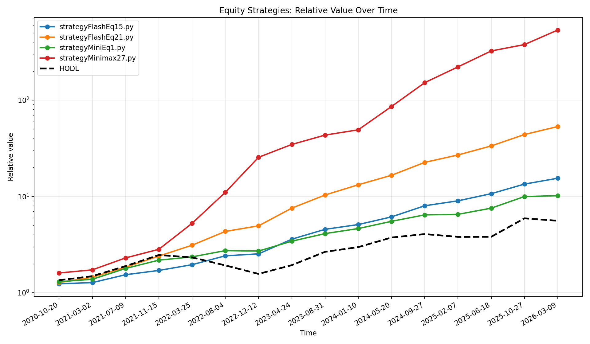
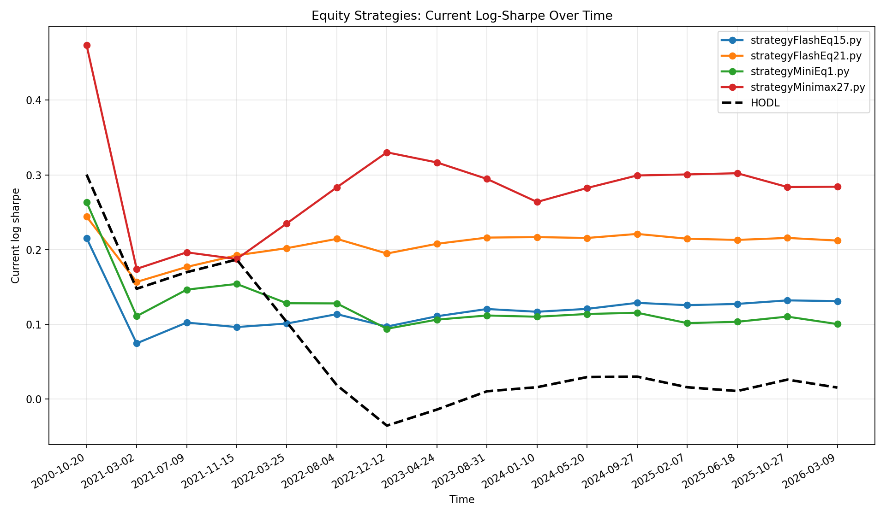
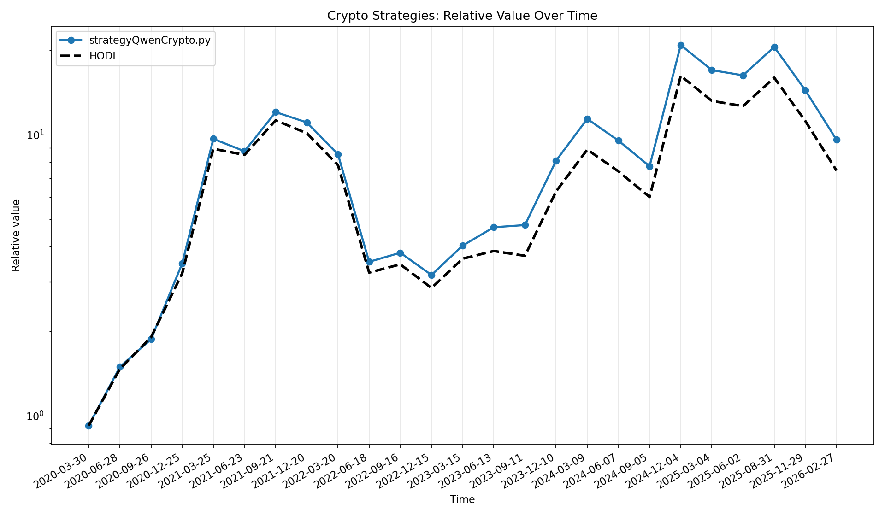
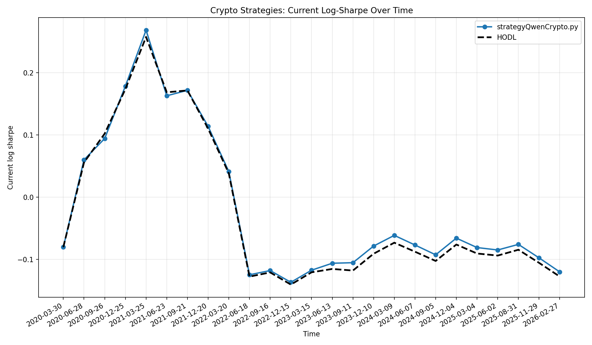

# Saved Strategy Results

This folder contains four strategies that were re-evaluated with `analyze_results.py` using the default setup:

- Equities: `AAPL`, `AMD`, `GOOGL`, `NVDA`
- Crypto: `BTC-USD`, `ETH-USD`, `XRP-USD`, `ADA-USD`
- Start date: `2019-01-01`

The charts below include a dashed `HODL` reference line. In the value charts, the y-axis is a relative value factor, not absolute cash.

One important point when reading these results: beating `HODL` is much harder than it first appears when the evaluation rewards risk-adjusted growth instead of raw return. In a strong bull market, `HODL` often wins simply by staying fully invested all the time and letting the major trend do the work. A strategy that tries to reduce drawdowns, sidestep volatility, or wait for cleaner entries may feel "safer", but it also spends more time out of the market. That missing exposure is expensive in runaway uptrends. As a result, a risk-aware strategy can look disciplined and still trail `HODL`, especially when the scoring uses a Sharpe-style penalty and the market keeps moving upward faster than the strategy can re-enter.

That trade-off is exactly why this folder is useful as more than just a showcase of what the current agent found. The framework is really a controlled test bench for strategy ideas. The agent can be replaced by anything that produces strategy code: another LLM, an evolutionary program synthesizer, a rules engine, a template library, or simply manual human invention. If you believe there is an easier way to beat `autoresearch-trading`, the cleanest way to check is to plug in a different strategy generation method and run it through the same walk-forward evaluation. That makes this repository a fair "beat the benchmark" challenge, not just a fixed AI demo.

## Warning

This folder should be read as an agentic-system benchmark, not as real trading advice. The strategies here were selected because they performed well inside this research harness, not because they are ready for live capital. A good backtest, a good walk-forward score, or even a favorable Sharpe-style result does not mean a strategy is robust enough for production trading.

That distinction also matches the broader AI-in-finance literature. Existing studies and surveys do report that machine learning can extract predictive structure from historical market data, but they also show that prediction quality in research datasets is not the same thing as a live, scalable, risk-controlled trading business. In practice, costs, turnover, market impact, data leakage, selection bias, and regime change often decide whether an apparently strong paper result survives contact with the real market.

For real application, the limitations are serious:

- The entire process is still vulnerable to backtest overfitting. Bailey, Borwein, López de Prado, and Zhu show that standard anti-overfitting procedures such as simple hold-out splits can be unreliable in investment backtests, and that high in-sample performance can easily be the result of selection bias rather than true edge.
- The simulation ignores many real frictions that matter in live execution: commissions, fees, spread, slippage, market impact, taxes, partial fills, liquidity constraints, and operational failures. In live trading, these can be large enough to erase a paper edge.
- Even when machine learning finds predictive structure in historical data, turning that into deployable trading profits is still difficult. Gu, Kelly, and Xiu show that machine learning can produce strong return forecasts in historical asset-pricing data, but that result does not remove the practical problems of implementation, capacity, turnover, and regime change.
- Transaction costs matter a lot. Fieberg, Metko, Poddig, and Loy explicitly note that higher turnover can nullify raw outperformance, and they find that some machine learning gains are much less attractive once trading frictions and market liquidity are taken seriously.
- Markets are non-stationary. A strategy learned on one period may fail when volatility, participation, monetary conditions, or market microstructure change. This is especially relevant in bull markets, where staying invested is often rewarded, but also in regime breaks where yesterday's pattern stops working.
- The data and execution model here are simplified by design. The repository is useful for comparing strategy-generation methods under a common research protocol, but it is not a substitute for institutional-grade research, execution, monitoring, and risk control.

Existing research on AI in finance is broad and growing, which is one reason this repository is interesting as a benchmark. Warin and Stojkov's systematic review maps a large academic literature on machine learning in finance, covering forecasting, prediction, and related financial applications. The right interpretation of this project is therefore: "Can your strategy-generation method produce ideas that survive this evaluation protocol better than the current one?" not "These strategies are ready to trade."

## Strategy Overview

| File | Strategy | Market | Main idea | Final value | Log sharpe |
|---|---|---|---|---:|---:|
| `strategyFlashEq21.py` | `dpo_st_adx_v26_optimized` | Equity | Reactive pullback-in-uptrend system using SuperTrend, DPO, ADX, ATR, and RSI | 51.51M | 0.2095 |
| `strategyFlashEq15.py` | `dpo_supertrend_adx_refined_v7` | Equity | Buy pullbacks inside strong uptrends, exit on reversal, ATR trail, or RSI profit-taking | 16.12M | 0.1381 |
| `strategyMiniEq1.py` | `dpo_williams_adx_regime_v2` | Equity | Buy oversold pullbacks in confirmed trends, exit with ATR trail plus percentage floor | 10.15M | 0.1000 |
| `strategyQwenCrypto.py` | `btc_patience_v11` | Crypto | Hold trend-following crypto positions with ADX-gated entries and adaptive ATR trailing exits | 9.88M | -0.1199 |

## Strategy Notes

### `strategyMinimax27.py`

This equity strategy found by MiniMax-M2.7 is best understood as a
volatility-aware trend-continuation system, not just as a more aggressive copy
of `strategyFlashEq21.py`.

- `ADX` acts as the trend gate, keeping entries inside already directional markets
- `MFI` defines a pullback zone, so the strategy buys pauses inside strength rather than chasing every breakout
- `RSI` requires some recovery before entry, which turns the setup into a "pullback, then rebound" trigger
- `ATR` drives both the initial risk control and a Chandelier-style trailing stop
- partial profit-taking locks in part of the move while preserving upside exposure
- an additional ATR/ADX deterioration rule exits trends that have gone stale

In practice, this gives the strategy a very specific personality: it wants to
buy orderly pullbacks inside strong uptrends, then hold with relatively patient
exit logic so that multi-leg trends can compound. Compared with the earlier
equity winners, it appears less interested in constantly flipping in and out and
more interested in catching the middle of sustained continuation moves while
still re-entering quickly when the trend resets.

That behavior lines up with the current analyzer output. It is the strongest
saved equity result in this folder, reaching roughly `534.04M` relative final
value with `0.2842` log sharpe / score, while staying profitable in all
`16/16` walk-forward folds. The gains are also fairly broad across the default
equity basket rather than coming from only one lucky ticker, although `AMD` and
`NVDA` appear to be the main performance accelerants.

At the same time, this is exactly the kind of winner that deserves careful
stress-testing. The optimizer repeatedly converges toward a tight parameter
corner with very fast trend detection, a fixed `2x ATR` trailing stop, and a
minimal re-entry wait. That does not make the result invalid, but it does make
it a strong candidate for the evaluator red-team workflow: a strategy that may
contain a real edge, yet could also be unusually well matched to the current
no-fees, no-slippage research harness and therefore should be re-tested on
alternative tickers, a final untouched holdout, and under hypothetical trading
frictions.

### `strategyFlashEq21.py`

This equity strategy found by gemini-flash-3.1 is a more aggressive member of the same broad
"buy pullbacks inside strong uptrends" family as `strategyFlashEq15.py`:

- `SuperTrend` defines the direction regime
- `DPO` looks for short pullbacks
- `ADX` keeps entries inside stronger trends
- `ATR` provides the trailing stop logic
- `RSI` acts as a momentum/profit-taking exit

Preliminary analysis suggests that this version wins by being much more
reactive and much more willing to re-enter than the earlier Flash equity
strategy. In the current analyzer output it is the strongest saved equity result
in this folder, reaching `51.51M` final value with `0.2095` log sharpe / score,
while staying profitable in all `16/16` walk-forward folds and generating
`1,341` total trades.

The fold-by-fold optimizer repeatedly converges toward very fast settings such
as near-zero `st_mult`, very short `dpo_p`, and effectively no entry cooldown.
That points to a strategy that is harvesting many short trend-aligned pullbacks
rather than waiting for only the cleanest setups. This likely explains the much
higher final value on the default equity basket, but it also makes the strategy
more aggressive and a bit more suspicious from an overfitting and
fees/slippage-sensitivity perspective than `strategyFlashEq15.py`.

This also makes `strategyFlashEq21.py` a good example for the evaluator
red-team workflow described in the main
[`README.md`](../README.md#evaluation-loophole-hunting). It may still contain a
real stock-mode edge, but its combination of high turnover, edge-hugging
parameters, and strong dependence on the default basket is exactly the kind of
result you would stress-test under fees, slippage, alternative tickers, and a
final untouched holdout to see whether it is exploiting a weakness in the score
or discovering something genuinely robust.

### `strategyFlashEq15.py`

This equity strategy combines:

- `SuperTrend` for market direction
- `DPO` to identify pullbacks
- `ADX` to require a strong trend
- `ATR` for a trailing stop
- `RSI` for profit-taking

In practice, it waits for an uptrend, buys a dip inside that uptrend, and exits when the trend breaks, volatility expands against the position, or momentum becomes overextended.

### `strategyMiniEq1.py`

This equity strategy found by MiniMax-M2.7 is a more compact trend-pullback system:

- `ADX` confirms that the market is trending
- `Williams %R` looks for oversold conditions
- `DPO` looks for a local cycle trough
- `EMA` keeps entries aligned with the broader trend
- `ATR` trail plus a percentage stop protect gains

It behaves like a disciplined “buy the dip in a healthy trend” model with dual stop logic on the exit.

### `strategyQwenCrypto.py`

This crypto strategy found by Qwen3.5-35B-A3B-GGUF:UD-Q4_K_XL by slower and more patient:

- `ADX` is used as the main trend-strength filter
- `EMA` helps confirm the trend
- `ATR` defines a dynamic trailing stop
- `min_hold`, `cooldown_sell`, and `profit_buffer_pct` try to avoid getting chopped out too early

The design is meant to let strong crypto trends run while using wider, trend-aware exits than a typical short-term stop system.

## Equity Diagrams

### Relative Value

### Log Sharpe

## Crypto Diagrams

### Relative Value

### Log Sharpe

## Files

- `summary.tsv`: compact numerical summary of the latest run
- `details.json`: per-strategy fold-by-fold data used for plotting
- `analyze_results.log`: full analyzer log
- `*.png`: comparison charts for equity and crypto

## Selected References

- Bailey, David H., Jonathan M. Borwein, Marcos López de Prado, and Qiji Jim Zhu. "The Probability of Backtest Overfitting." *Journal of Computational Finance* (2016). https://ssrn.com/abstract=2326253
- Gu, Shihao, Bryan Kelly, and Dacheng Xiu. "Empirical Asset Pricing via Machine Learning." *Review of Financial Studies* 33, no. 5 (2020): 2223-2273. https://www.nber.org/papers/w25398
- Fieberg, Christian, Daniel Metko, Thorsten Poddig, and Thomas Loy. "Machine Learning Techniques for Cross-Sectional Equity Returns' Prediction." *OR Spectrum* 45 (2023): 289-323. https://link.springer.com/article/10.1007/s00291-022-00693-w
- Warin, Thierry, and Aleksandar Stojkov. "Machine Learning in Finance: A Metadata-Based Systematic Review of the Literature." *Journal of Risk and Financial Management* 14, no. 7 (2021): 302. https://www.mdpi.com/1911-8074/14/7/302
- Rundo, Francesco, Francesca Trenta, Agatino Luigi di Stallo, and Sebastiano Battiato. "Machine Learning for Quantitative Finance Applications: A Survey." *Applied Sciences* 9, no. 24 (2019): 5574. https://www.mdpi.com/2076-3417/9/24/5574
